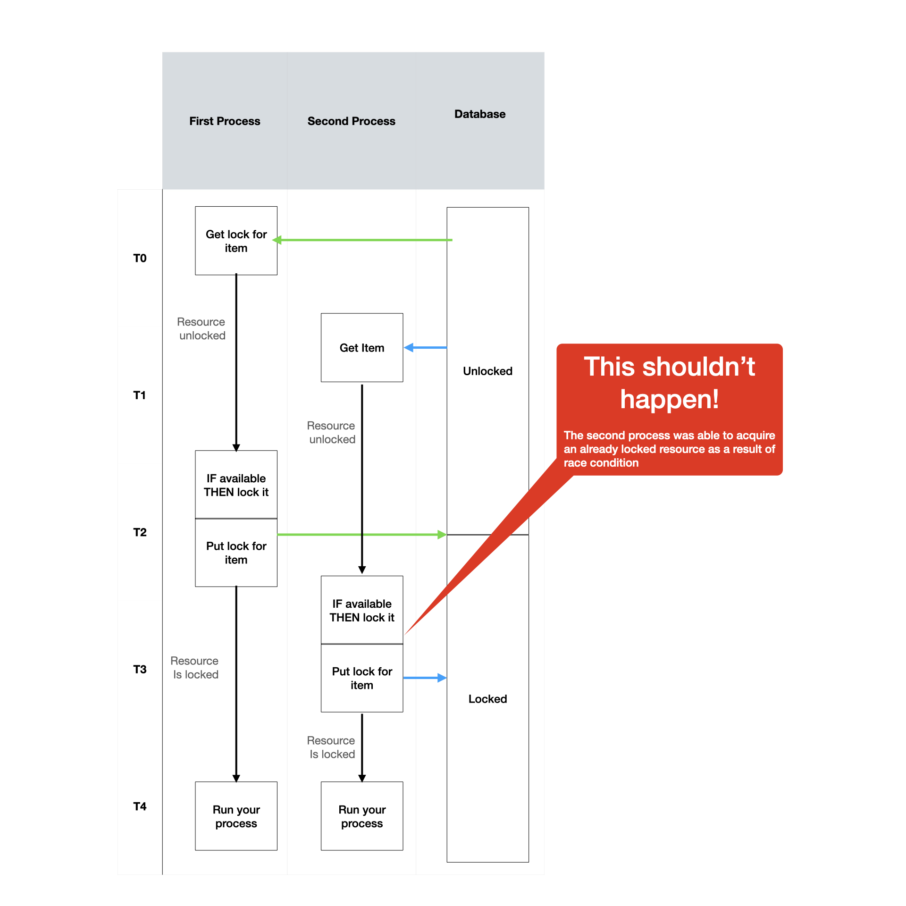

## Description

Locks manager is a DynamoDB based locking system.
The manager uses atomic actions to assure tight locking,
in addition each lock holds the lock's owner so that other process can't hijack the lock.

## Purpose
This document is provide to serve as guide for the locks manager and how to use it.
The objective of this document is to understand the flow and functions available in the package.

## Scope
This document is intend for the R&D team.
It will cover all necessary instructions as well as theory.

## Introduction
When implementing locks there are two main approaches optimistic lock and mutual exclusion lock (Mutex).

#### Optimistic Locks
Optimistic locks are useful when you update data, you are aware that it could have
been updated by some other process as the same time,
and **Most** important you are o.k with it.

Optimistic locks implements the following guidelines:
1. Record a timestamp when the change begun.
2. tentatively Read/write data with your changes.
3. Check if some else made any changes on the same data
4. Resolve conflicts (if applicable) and commit your changes.

#### Mutex locks
Mutex lock are more rigid and intended for cases when you **must** have only one source of truth.
In mutex lock when one process is running there and another process is trying to make any changes
it will fail.
The second process will be noticed that the data used by another process,
and will fail to acquire lock.

Mutex locks implement the following guidelines:
1. Create lock or fail.
2. if lock acquired - update the data.
3. Release the lock.

#### Atomic actions
In order to achieve the mutex functionality using a DB atomic actions are due.
Take the following implementation, for example:

```
function acquireLock(lockId){
    const lock = this.dynamoDB.getLockById(id);
    if (!lock) {
        this.dynamoDB.acquireLock(id);
        return true;
    }
    return false;
}
```
This approach implements the optimistic lock, meaning between the ```getLockById()``` function call
and the ```acquireLock()``` function call there are is a gap, whereas short as it is there can still
be another process.
In that case the second process will get green light to proceed which is a false positive response.




This locks manger is implementing the concept of mutual exclusion (mutex) locks.
It will use DynamoDB as backend and conditional expressions for create/delete actions
to assure atomic cations and exclusion.
We have also added another feature to the locks where each lock has both id and owner.  
Meaning two different processes won't be able to hijack a lock form one another.

## Prerequisite
In order to use Locks Manager you must have a dynamoDb instance running and a dedicated table
For locks (and of coarse aws policy) .<br>
We recommend the usage of different table for each service.

The table schema should be as follows:
This example is using cloud formation, however, you cna build the table in any other way.
Don't forget to replace <<YOUR-TABLE-NAME>>.

```
  ##########################################
  # DynamoDb Tables                        #
  ##########################################

  LocksManagerDynamoDbTable:
    Type: AWS::DynamoDB::Table
    Properties:
      AttributeDefinitions:
        - AttributeName: id
          AttributeType: S
      BillingMode: PAY_PER_REQUEST
      KeySchema:
        - AttributeName: id
          KeyType: HASH
      TableName: !Sub '${Environment}-<<YOURE-TABLE-NAME>>'
      Tags:
        - Key: Name
          Value: masi-locks-manager
        - Key: Environment
          Value: !Ref Environment
      TimeToLiveSpecification:
        AttributeName: ttl
        Enabled: true

  ##########################################
  # Lambda with policy example             #
  ##########################################
        
  LambdaWithPolicFunction:
    Type: AWS::Serverless::Function
    Properties:
      Description: Use lambda with DynamoDB table
      FunctionName: !Sub '${Environment}-lambda-with-policy'
      Handler: path/to/your/handler
      MemorySize: 128
      Timeout: 5
      Policies:
        - Statement:
            - Sid: LocksManagerTable
              Effect: Allow
              Action: [
                  "dynamodb:DescribeTable",
                  "dynamodb:Delete*",
                  "dynamodb:PutItem"
              ]
              Resource: !GetAtt LocksManagerDynamoDbTable.Arn
      Environment:
        Variables:
          LOCK_MANAGER_TABLE_NAME: !Ref LocksManagerDynamoDbTable        
```

## Usage

```
import { LocksManager} from '@melio/locksmanager'

// The options object and each of its properties are all optional.
// If not provided default values will be applied.
const options: LocksManagerOptions = {
  tableName: 'your-custom-table',
  lockTimeoutInSec: 60, // Min 30 sec
  maxAllowedTriesNumber: 15,
  lockRetryIntervalInMs: 2000,
}

LocksManager.init([options]);

const locksManager: LocksManager = LocksManager.getInstance();

const id = 'some-unique-id';

// Use either acquire for single attempet  
const lock = await locksManager.acquire(id);

// or acquireWithRetry for multiple attempts
const lock = await locksManager.acquireWithRetry(id);

// ...Some code need db locking

await locksManager.release(lock);

// Check if lock exists
// Will return true if id exist and current time is before is active, false otherwise.

const isLocked = await locksManager.isLocked(id);
```

## Using local dynamo instance
You can use a local instance of DynamoDB (i.e. for testing via DOcker).
After your instance is running you can set the init options as follows: 
```
const options: LocksManagerOptions = {
  dynamoInstanceEndpoint: 'localhost:8000'
} 
```
Note that same as in standard usage you can still config all the other parameters as well.
Don't forget to replace the `localDynamoInstanceUrl` with yours.

#### Release History
 * 1.0.0 - First release Lock manager based on DynamoDb
 * 2.0.0 - **Note! This version is not backward compatible with previous version.** The locking concept has changed. This version will set lock expiration time as `now + requested locking time`. New lock request will compare between `now` and expiration time as it was set in the record.
 * 3.0.0 - **Note! This version is not backward compatible with previous version.** Removed withLock functionality.
 * 3.0.1 - Fixed logs
 * 3.0.2 - Changed minimum allowed lock timeout to 3 seconds
 * 3.0.3 - We now support the usage of custom DynamoDB instance.
 If you wish to lock anything you can use acquire/acquireWithRetry and release on done/error.
 Added maxRetries as optional to acquireWithRetry function.

##### References
1. [The right way to implement a mutex with dynamodb](https://blog.revolve.team/2020/09/08/implement-mutex-with-dynamodb/)
2. [Conditional Expressions in DynamoDB](https://docs.aws.amazon.com/amazondynamodb/latest/developerguide/Expressions.ConditionExpressions.html)
3. [Building Distributed Locks with the DynamoDB Lock Client](https://aws.amazon.com/blogs/database/building-distributed-locks-with-the-dynamodb-lock-client/)
